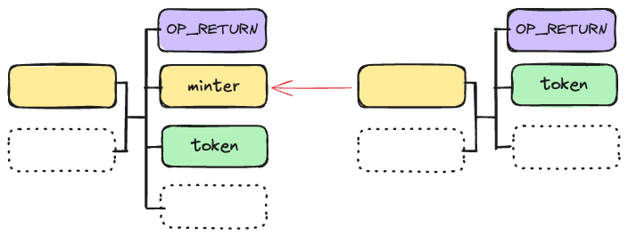
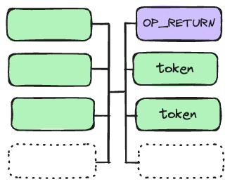
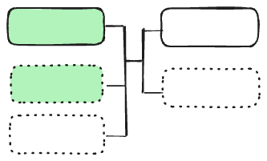

# CAT20 规范

## 1. 部署


为了部署一个代币，我们采用了利用 Taproot（P2TR）的`提交与揭示（commit and reveal）`方案。我们将第一个交易称为代币创世交易，第二个称为揭示交易。在揭示交易的输入的见证脚本中，我们包含一个`CAT`封装以嵌入代币元信息。字节序列 `cat`（十六进制为 `0x636174`）表示该封装是 CAT 协议的一部分。

```assembly
OP_FALSE 
OP_IF 
    OP_PUSH "cat" 
    OP_PUSH 1 // 同质化代币 
    OP_PUSH <JSON> // CBOR 编码 
OP_ENDIF
```

JSON 文件必须包含以下字段：

```json
{
  "name": "cat",
  "symbol": "CAT",
  "decimals": "2"
}
```

JSON 为 CBOR 编码。如果长度超过推送数据限制的 520 字节，则会被分割成多个块并在解码前进行拼接。可以添加更多字段以进行自定义元数据。

揭示交易必须遵循以下规则才能有效：

1. 输入中只有一个封装。
2. 第一个输出是使用递归契约（recursive covenants）编码状态的 `OP_RETURN`。
3. 第一个输出之后有一个或多个相同脚本的铸造输出（minter outputs），且不能有其他输出。注意，禁止存在找零输出<sup>[1](#脚注)</sup>。部署后，代币由创世交易中的提交输出唯一标识。`tokenId` 由创世交易的 `txid` 和输出索引组成，格式如下：`txid_vout`

:::warning `注意`  
代币名称/符号不是唯一的，任何人都可以部署与之前部署的代币具有相同名称/符号的代币，类似于 ERC20。
:::

## 2. 铸造

任何管理代币铸造过程的规则都在其铸造智能合约中通过契约执行。新代币可以通过在代币揭示交易中花费铸造 UTXO 来铸造。它可以生成新的铸造 UTXO，这些 UTXO 可以递归地花费以进一步铸造代币。新代币只能通过花费铸造 UTXO 来发行。

一个铸造交易必须遵循以下规则才能有效：

1. 只有一个铸造输入。
2. 只有一个代币输出。
3. 如果存在铸造输出，代币输出必须紧随其后。注意，可以有零个或多个铸造输出。


与由索引器强制执行的代币铸造相比，CAT20 代币的铸造可以通过编程其铸造合约灵活地自定义，只要遵循上述规则。代币发行者可以定义任意的铸造规则，而无需更改基础协议，不同于基于索引器的协议。一些用例如下：

- 只有在向指定地址支付一定数量的比特币时才能铸造。
- 只有在特定时间或区块高度之后才能铸造。
- 只有在展示工作量证明时才能铸造，类似于比特币挖矿，但难度较低。
- 只有持有某种不同代币的人才能铸造。
- 只有在一些比特币被时间锁定时才能铸造：锁定的比特币越多，时间锁定越长，可以铸造的代币越多。

### 开放式和封闭式铸造

`开放式铸造`（也称为`无许可铸造`）指的是代币发行过程，任何人都可以参与铸造新代币。代币的创建者指定总供应量和每笔交易的铸造限制等参数，铸造智能合约强制执行这些参数。这类似于 `BRC-20`。

:::warning `注意`  
铸造限制可以是动态的，并且可能在整个铸造过程中发生变化。例如，指数衰减铸造可以通过在每次铸造后将限制减半来编程：第一次铸造发行 100 个代币，第二次 50 个，第三次 25 个，依此类推。
:::

`封闭式铸造`（也称为`许可铸造`）则只有授权方（例如代币发行者）可以铸造新代币。铸造合约通常会检查这些授权方的签名。铸造 UTXO 只能通过他们的签名来花费，因此只有他们可以铸造新代币。这类似于 `ERC20`。

### 预挖

开放式和封闭式铸造并不互相排斥。例如，铸造合约可以要求发行者签名仅适用于前几次铸造，但不适用于后续铸造。这允许在向公众开放铸造之前预分配一定数量的代币，即进行预挖。

### 限量供应

在初始铸造交易之后，可以通过重复消耗和创建铸造 UTXO 来铸造更多代币。在需要固定供应量的情况下，最后一次铸造不会创建新的铸造 UTXO。放弃铸造能力则创建了一个可以证明供应量有限的代币。


### 并行铸造

如果一个代币只有一个铸造 UTXO，并且有多个用户尝试通过花费它来铸造该代币，只有其中一个用户会成功，其他所有用户都会失败。这种竞争可能会在开放式铸造中发生。为缓解此问题，铸造交易可以创建多个（例如 N 个）铸造 UTXO。我们称参数 N 为铸造的`并发性`。它允许随着铸造的进展，铸造 UTXO 数量呈指数增长。通过明智地选择 UTXO，可以显著减少竞争，如下所示，其中 `N = 2`。所有铸造交易形成一个以揭示交易为根的树，而不是当 `N = 1` 时形成一个链，铸造必须是顺序的。


## 3. 转移

一个可替代代币（FT）UTXO 可以拆分成小额。多个代币 UTXO 可以合并成一个 UTXO，前提是它们都源自同一个创世交易。通常，一个代币转移交易中可以有多个代币输入和输出，并且它们可以出现在交易的任何位置。代币余额的保持由矿工强制执行：输入中的代币数量必须等于输出中的代币数量。

不同类型的代币可以在同一个交易中进行转移。每个代币的余额都会被保持。以下示例展示了在单个交易中转移两种不同类型的代币。


## 4. 燃烧

代币可以被燃烧，其来源链将被终止。存储在其 UTXO 中的聪将被熔化到一个常规的非契约地址，有效地“去色”。


### 脚注

这防止了多种类型的代币具有相同的 `tokenId`，因为它们共享相同的创世输出点。
